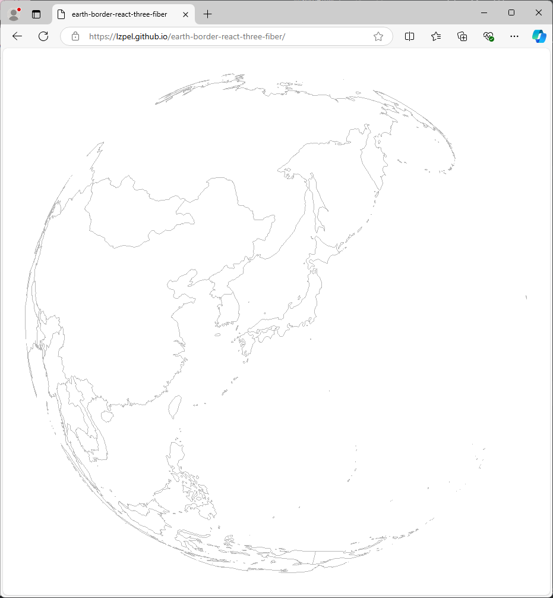

# earth-border-react-three-fiber

just country borders using three.js

DEMO: https://lzpel.github.io/earth-border-react-three-fiber/



## Getting Started

First, run the development server:

```bash
npm run dev
# or
yarn dev
# or
pnpm dev
# or
bun dev
```
